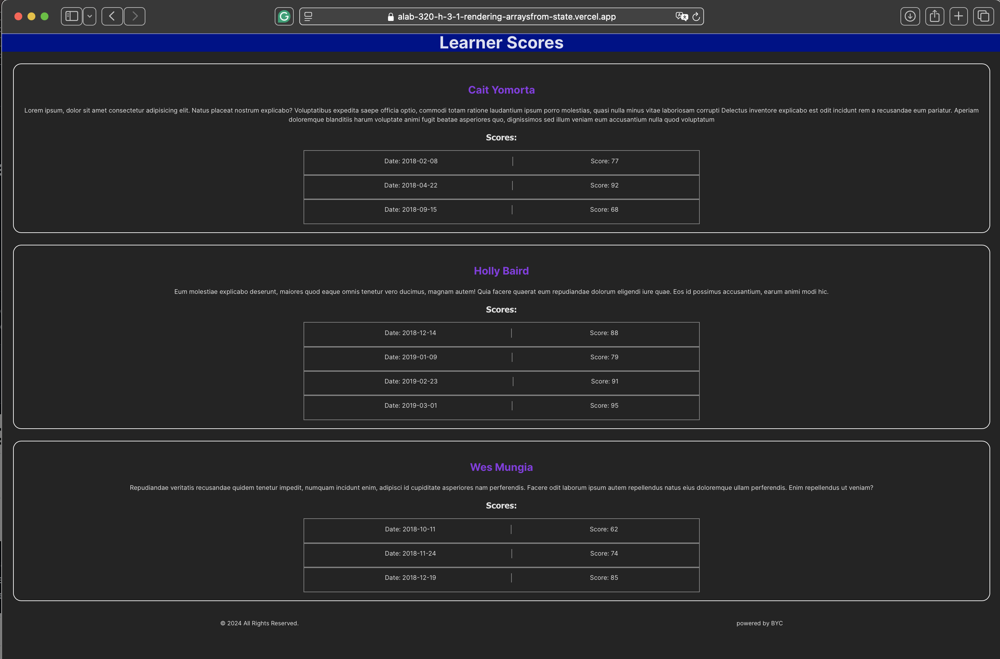

# React + Vite
# Project name: ALAB320H.3.1-RenderingArraysfromState"
# Author: Michael Marquez
# Per Scholas: Cohort #31
# date written: Sep 19, 2024 

- This was created using REACT + Vite, CSS and JSX.
- Data was loaded using REACT useState() containing an array of objects  
- Responsive design using css Grid.

Run the process:
    at the terminal, npm run dev
    open the browser to navigate to url:PORT
    
 

### The Learner Score

